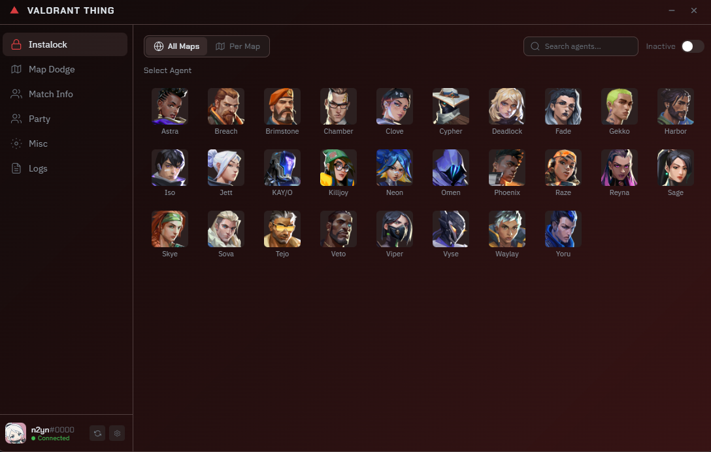
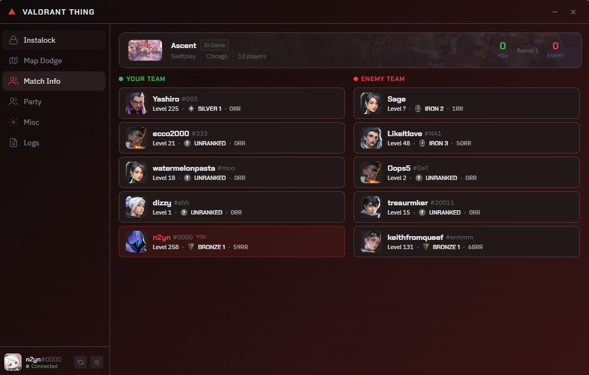
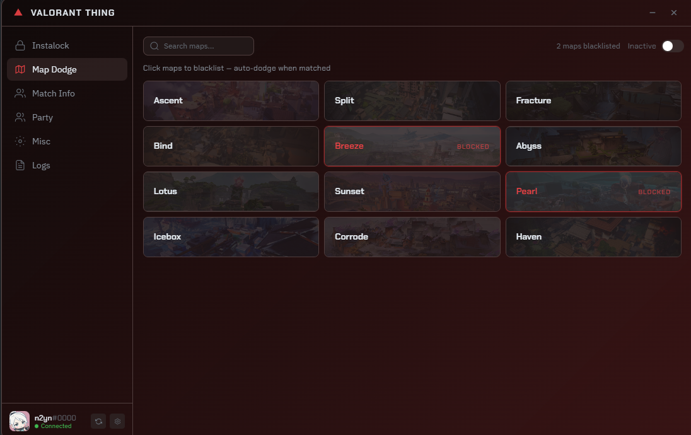

<p align="center">
  
</p>

<h1 align="center">Valorant Thing</h1>

<p align="center">
  A lightweight desktop companion app for Valorant - instalock agents, dodge maps, manage your party, view live match info, and more. Built with Tauri + Rust + React.
</p>

<p align="center">
  
  
  
</p>

---

## Screenshots






---

## Features

### Agent Instalock
Pick a default agent or set **per-map selections** - the app automatically selects and locks your agent the moment you enter agent select. Configurable select and lock delays so you can tune the timing.

### Map Dodge
Blacklist maps you don't want to play. When the app detects you loaded into a blacklisted map, it automatically dodges for you. Simple as that.

### Live Match Info
See all players in your current match with their **agents, ranks, RR, and account levels**. Works in both agent select and in-game. Shows the current map, game mode, server, and live score.

### Party Management
View your party members, kick players, generate/join party codes, toggle open/closed party, and queue/dequeue - all from one page. Queue restriction errors are caught and shown clearly.

### Misc Automation
- **Auto Unqueue** - automatically leaves queue if a player dodges
- **Auto Requeue** - instantly requeues after a match ends

### Discord Rich Presence
Shows what you're up to in your Discord status:
- Current game phase (lobby, agent select, in-game)
- Locked agent name
- Live match score
- Active features (autolocking, map dodging)

### Customization
8 built-in themes (Crimson Moon, Radianite, Midnight Blurple, Chroma Glow, Forest, Mars, Dusk) plus a **fully custom theme builder** with gradient editor and color pickers. Simplified mode strips the background gradient for a cleaner look.

### System Tray
Minimize to tray instead of closing. Left-click the tray icon to restore, right-click for Show/Quit. Optional Windows notification when minimized.

### Start with Windows
Launch the app automatically on boot, optionally starting minimized in the system tray.

---

## How It Works

Valorant Thing talks to two sets of APIs:

**Local Valorant Client API** — When Valorant is running, it exposes a local HTTP server on `127.0.0.1`. The app reads the lockfile to grab the port and auth token, then uses it to:
- Generate entitlement tokens (used to authenticate with the remote API)

**Riot PD / GLZ APIs** — Authenticated remote endpoints for things the local API doesn't cover:
- Player MMR and rank data (`pd/mmr/v1`)
- Player name resolution (`pd/name-service/v2`)
- Match details from the GLZ shard servers
- Detect game phase (pregame, in-game, menus)
- Select and lock agents
- Fetch party data and manage queue state
- Dodge matches
- Get the match roster and live score

**valorant-api.com** - A public community API used to fetch static assets like agent icons, map images, and competitive tier data.

**Henrik API** *(optional)* - If you provide an API key, the app can resolve player names and MMR through Henrik's API as a fallback, bypassing hidden mode and hidden level.

All API calls happen in the **Rust backend** via Tauri commands - the React frontend never touches any credentials directly.

---

## Tech Stack

| Layer | Tech |
|-------|------|
| Framework | [Tauri v2](https://v2.tauri.app) |
| Frontend | React 19, TailwindCSS 3 |
| Backend | Rust |
| Packaging | NSIS installer (Windows) |
| Discord RPC | `discord-rich-presence` crate via IPC |

---

## Building from Source

### Prerequisites
- [Node.js](https://nodejs.org/) (v18+)
- [Rust](https://rustup.rs/) (stable)
- [Tauri CLI prerequisites](https://v2.tauri.app/start/prerequisites/)

### Setup

```bash
git clone https://github.com/AjaxFNC-YT/Valorant-Thing.git
cd Valorant-Thing
npm install
```

### Development

```bash
npx tauri dev
```

### Production Build

```bash
npx tauri build
```

The installer will be at:
```
src-tauri/target/release/bundle/nsis/Valorant Thing_x.x.x_x64-setup.exe
```

---

## Configuration

All settings are stored in `localStorage` and persist between sessions:

| Setting | Default | Description |
|---------|---------|-------------|
| Theme | Crimson Moon | App color theme |
| Simplified | Off | Flat background mode |
| Discord RPC | On | Show status in Discord |
| Start with Windows | Off | Auto-launch on boot |
| Start Minimized | Off | Launch hidden in tray |
| Select Delay | 0ms | Delay before agent select |
| Lock Delay | 0ms | Delay before agent lock |
| Henrik API Key | - | Optional, for player name resolution |

---

## Disclaimer

This project is not affiliated with or endorsed by Riot Games. Use at your own risk. The app interacts with local and remote Valorant APIs - while it doesn't modify game files, automated agent locking and match dodging may violate Riot's terms of service.

---

## License

Proprietary
